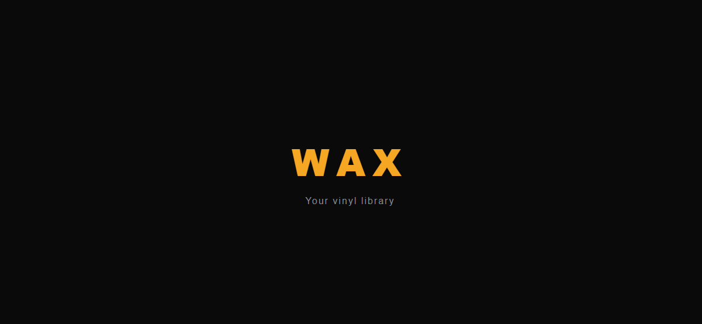

# WAX (Website) 📀

> Your vinyl library, soon in your browser.

<div style="text-align: center;">
  
</div>

---

## What is WAX Web?

WAX Web is the Next.js web companion to the [WAX mobile app](https://github.com/Ev0gs/WaxApp). It currently handles the password reset flow for WAX users, and will evolve into a full web version of the app.

---

## Features

- 🔐 **Password reset** — Secure password reset page bridging Supabase email links and the WAX mobile app
- 🌐 **Web companion** — Foundation for a future full web version of WAX

---

## Tech Stack

| Category | Technology |
|---|---|
| Framework | Next.js 16 (App Router) |
| Language | TypeScript |
| Styling | Tailwind CSS |
| Backend & Auth | Supabase |
| Deployment | Vercel |

---

## Project Structure

```
wax-web/
├── app/
│   ├── layout.tsx              # Root layout
│   ├── page.tsx                # Home page
│   ├── globals.css             # Global styles
│   └── reset-password/
│       └── page.tsx            # Password reset page
├── lib/
│   └── supabase.ts             # Supabase client
└── public/                     # Static assets
```

---

## Getting Started

### Prerequisites

- Node.js 18+
- A [Supabase](https://supabase.com) project (same as the WAX mobile app)

### Installation

```bash
# Clone the repository
git clone https://github.com/your-username/wax-web.git
cd wax-web

# Install dependencies
npm install

# Create your environment file
cp .env.example .env.local
```

### Environment Variables

Create a `.env.local` file at the root of the project:

```bash
NEXT_PUBLIC_SUPABASE_URL=your_supabase_project_url
NEXT_PUBLIC_SUPABASE_ANON_KEY=your_supabase_anon_key
```

### Run the app

```bash
npm run dev
```

Open [http://localhost:3000](http://localhost:3000) in your browser.

---

## Deployment

This project is deployed on [Vercel](https://vercel.com). To deploy your own instance:

```bash
npx vercel --prod
```

Make sure to add your environment variables in the Vercel dashboard under **Settings → Environment Variables**.

### Supabase Configuration

In your Supabase project → **Authentication → URL Configuration** :

**Site URL:**
```
https://your-project.vercel.app/reset-password
```

**Redirect URLs:**
```
https://your-project.vercel.app/reset-password
https://your-project.vercel.app/**
wax://
wax://**
wax://reset-password
wax://login
wax://auth/callback
```

---

## Roadmap

- [ ] Landing page — app presentation and APK download link
- [ ] Full web version of WAX
- [ ] Collection sharing — public crate pages

---

## Related

- [wax](https://github.com/Ev0gs/WaxApp) — The React Native mobile app
- [Supabase](https://supabase.com) — Backend & auth
- [Discogs API](https://www.discogs.com/developers/) — The vinyl database powering WAX

---

## License

MIT — feel free to use this project as inspiration for your own.

---

<p style="text-align: center;">
  Built with 🎵 and too many vinyl records
</p>